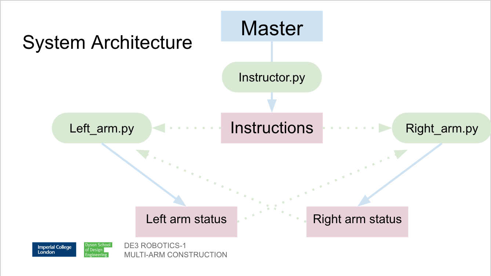

**********************
Algorithm Architecture
**********************

Node Funtionality
=================

Our algorithm is broken down into a number of key nodes:

================  ============================================================
Nodes             Function
================  ============================================================
instructor.py     Used to test the functionality of each arm and run the full demo. In 		          instructor we define two dictionaries that define core functionalities 		  of the arms in terms of messages that can be posted to topics. 
right_arm.py      class for Baxter’s right arm and a set of functions.
left_arm.py       class for Baxter’s left arm and a set of functions.
spawning          A number of scripts for spawning various objects into the gazebo 			  environment (just for the simulation)
================  ============================================================

Node Structure
==============

Given the nature of our task, we needed to build an algorithm that enables communication between the two arms. We do this using a series of topics which the arms and instructor publish and subscribe to: 

================  ============================================================
Topics            Subscribing/Publishing
================  ============================================================
Instructor_left   left_arm.py/instructor.py
Instructor_right  right_arm.py/instructor.py
Left_status       right_arm.py/left_arm.py
Right_status      left_arm.py/right_arm.py    
================  ============================================================

Our demo is performed using a sequence of functions which do various parts of the task. These functions work like a ‘cascade’, the last line of each function is calling the next one. Within the functions the topics are listening to and posting to the various topics. We have structured our code in this way because communicating between the arms is critical.

Publishing Instructions
=======================

In instructor.py we define a dictionary of commands for the right and left arms. The dictionary consists of numbers, ascribed to strings which serve as the instructions. These instructions are what are posted to the topics during operation.

	.. code-block:: bash
	
		rightarm_dict = {               
		1: 'calibrate',
    		2: 'demo',
    		3: 'move to cpose',
    		4: 'open',
    		5: 'close',
    		6: 'hover brick',
    		7: 'pick brick',
    		8: 'move to center',
    		9: 'release brick',
    		10: 'manual move',
    		11: 'angles'
		}

		leftarm_dict = {          
    		1: 'calibrate',
    		2: 'demo',
    		3: 'move to cpose',
    		4: 'open',
    		5: 'close',
    		6: 'hover place',
    		7: 'place brick',
    		8: 'move near center',
    		9: 'grab brick',
    		10: 'manual move',
    		11: 'angles'
		}