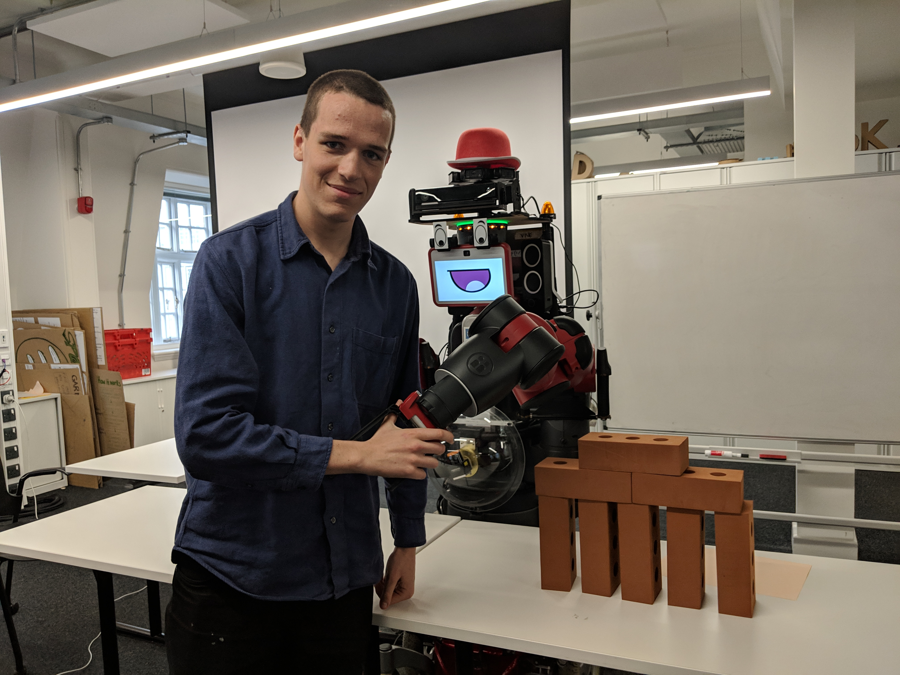

*****************
Zeroing the Robot
*****************
 
When using the physical robot, calibration is necessary to mark the positions of the starting stack of bricks and the finishing built structure.When the calibration function is run, it stores the cartesian position and joint angles corresponding to the end-effector�s current position. The cartesian position is used in other functions and the joint angles are used to efficiently return the arm to that position after certain movements.

.. note:: This process is not necessary for the simulation, as the robot arms automatically move to the starting position to the 'zero' home position based on the cartesian space coordinates in Gazebo World.

Finding the zero position
=========================

.. note:: Zeroing is referred to as calibration in our code

1. Move the right arm so that the end-effector is resting on the top brick in the stack closest to the centre of the robot. Make sure the arm approaches the brick pile vertically, to pick the brick across the wider section.

2. On the instructor terminal, run the right_arm_calibrate function

3. Move the left arm so that the end-effector is resting on the table in the position of the brick position closest to the centre of the robot. Make sure the arm approaches the table vertically, the same position as the right arm.

4. On the instructor terminal, run the left_arm_calibrate function.

5. You have successfully calibrated the starting positions of DENIRO

