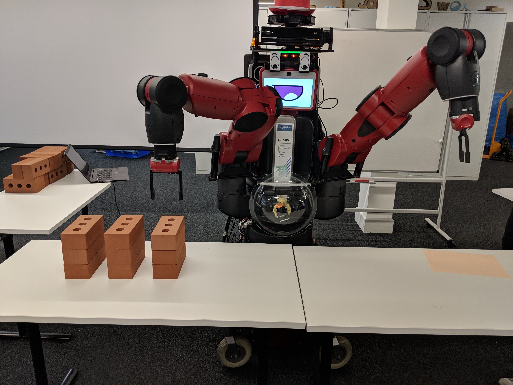
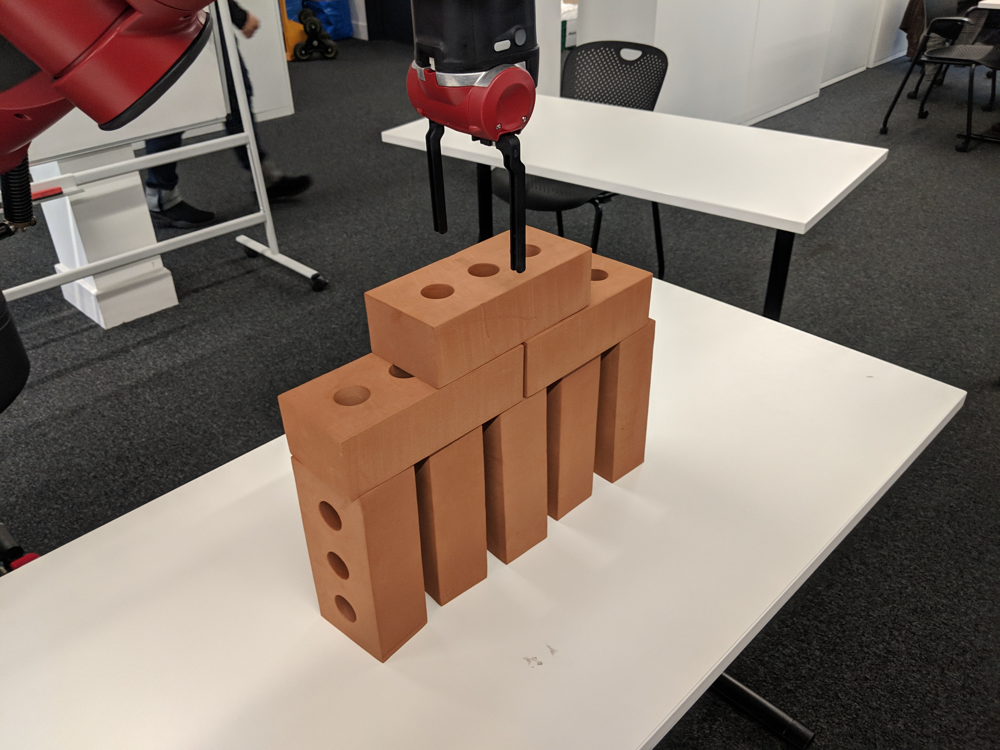

******************
Video Explanations
******************

Follow along video explanations with our wonderful host, Nirav Ganju-Cass:

1. Project Overview
===================

.. raw:: html

    

        <iframe src="https://www.youtube.com/embed/dFYozg49RXo" frameborder="0" allowfullscreen style="position: absolute; top: 0; left: 0; width: 100%; height: 100%;"></iframe>
    

::

    
2. Setting up our demo
======================

.. raw:: html

    

        <iframe src="https://www.youtube.com/embed/oc8reodyNz4" frameborder="0" allowfullscreen style="position: absolute; top: 0; left: 0; width: 100%; height: 100%;"></iframe>
    

::

    
3. Simulation of task
=====================

.. raw:: html

    

        <iframe src="https://www.youtube.com/embed/rlpKniDhGiM" frameborder="0" allowfullscreen style="position: absolute; top: 0; left: 0; width: 100%; height: 100%;"></iframe>
    

