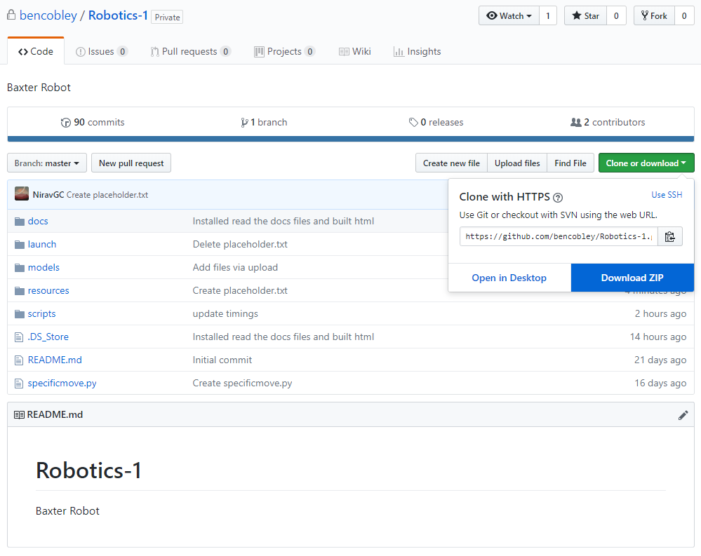
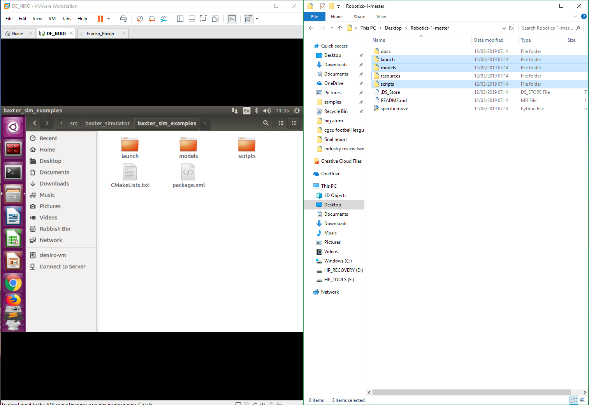

***********
Calibration
***********

The best performance in the simulation was achieved using the Baxter Robot environment, instead of the ROBOT DE NIRO environment. The Baxter Robot environment runs on the ROBOT DE NIRO virtual machine. 

Method
======

1. Download Software to Run Virtual Machines 
============================================

VMware Workstation download instructions can be found here:
https://imperialcollegelondon.app.box.com/s/j78jcfiy1z08tw8ck3m6cwn24qgpffek/folder/63857247371

2. Download DE NIRO VM 
======================

**DE NIRO Virtual machine**

https://imperialcollegelondon.app.box.com/s/j78jcfiy1z08tw8ck3m6cwn24qgpffek/folder/63861642030

Once downloaded, extract DE_NIRO.zip and open up the VM in VMWare Workstation.

It's recommended to turn on "3D acceleration" of the VM in
::
 VM -> Settings -> Display -> 3D acceleration checkbox
::

Run the VM, and log in using 
::
 *user* robin
 *pass* deniro
::

3. Complete Baxter Workstation Setup 
====================================

Complete Baxter Workstation Setup

http://sdk.rethinkrobotics.com/wiki/Workstation_Setup

Run the DE NIRO VM, in a new Terminator window follow instructions to Install ROS
    
========= ==============================================
Step 2    Install ROS
Step 3    Create Baxter Development Workspace
Step 4    Install Baxter SDK Dependencies
Step 5    Install Baxter Research Robot SDK
Step 6    Configure Baxter Communication/ROS Workspace
Step 7    Verify Environment
========= ==============================================

4. Complete Baxter Simulator Installation 
=========================================

Follow instructions: 

http://sdk.rethinkrobotics.com/wiki/Simulator_Installation#Baxter_Simulator_Installation

Simulation heading contains important instructions for running the gazebo environment.

5. Downloading our files from GitHub 
====================================

To access our demo and files, you need to download the files from our github.

On your laptop (not the Virtual Machine) download the github repository https://github.com/bencobley/Robotics-1  as a zip folder.

Once downloaded, extract the files to your desktop (or wherever you like, just somewhere easily found again).

The next step is to merge this folder with the baxter_sim_examples folder in the Virtual Machine.

In the Virtual Machine go to the highlighted folder using the program "Files" [grasping_ws/src/baxter_simulator/baxter_sim_examples]

Now the tricky bit. Half your screen with the left showing VMWare and the right showing the contents of the github repository zip folder.

- Now copy the folders "launch", "models" and "scripts" across into the Virtual Machine.

- The following message will appear

::

 Merge folder “launch?" > yes, "Merge"

 Replace file “model.urdf?" > "Replace"

 Replace file “right_arm.py?" > "Replace"

::

This has merged the existing folders with the ones from github. You are ready to start moving arms.
